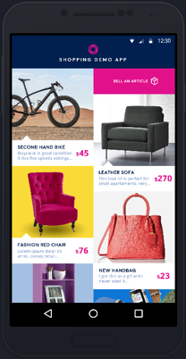
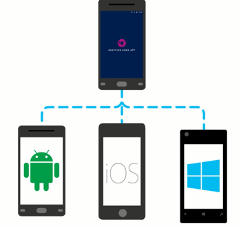
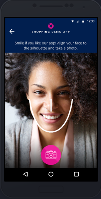

Xamarin and Azure Better Together Quickstarts
=============================================

Shopping Demo App Overview
--------------------------

Learn how to connect your Xamarin mobile apps to the cloud. The Shopping Demo App is a great business-to-consumer application sample available on multiple platforms. This mobile app demo uses a wide range of Azure services to help users authenticate with Facebook or Twitter, sell and buy personal items, get notifications when items are purchased, and rate the app with a smile. Play with the app code in our GitHub repo, find documentation that shows you how to connect your apps to the cloud, and deploy it to your own Azure subscription now.

   

App Service is a platform-as-a-service (PaaS) offering of Microsoft Azure. It allows to create mobile apps for any platform or device. You can integrate your apps with several SaaS solutions as Authentication, Push Notifications, Storage, etc.

The following tutorials explain how to work with App Service and show you quickly and easily use several App Service features based on the Shopping Demo App available on GitHub

-   [Authenticate and authorize users with Twitter and Facebook](https://github.com/Microsoft/XamarinAzure_ShoppingDemoApp/wiki/Authentication-Authorization)

-   [Allow your app to work offline and sync after](https://github.com/Microsoft/XamarinAzure_ShoppingDemoApp/wiki/Offline-Data-Sync)

-   [Send and receive push notifications on iOS, Android, and Windows](https://github.com/Microsoft/XamarinAzure_ShoppingDemoApp/wiki/Push-Notifications)

-   [Store your app data in the cloud](https://github.com/Microsoft/XamarinAzure_ShoppingDemoApp/wiki/Storage)

-   [Use Microsoft Cognitive Services to personalize your app’s responses](https://github.com/Microsoft/XamarinAzure_ShoppingDemoApp/wiki/Cognitive-Services)

# How to sign up for Microsoft Azure#

You need an Azure account to work with this demo code. You can:
 - Open an Azure account for free.[Azure subscription](https://azure.com/). You get credits that can be used to try out paid Azure services. Even after the credits are used up, you can keep the account and use free Azure services and features, such as the Web Apps feature in Azure App Service.
 - [Activate Visual Studio subscriber benefits](https://azure.microsoft.com/en-us/pricing/member-offers/msdn-benefits-details). Your Visual Studio subscription gives you credits every month that you can use for paid Azure services.
 - Not a Visual Studio subscriber? Get a $25 monthly Azure credit by joining [Visual Studio Dev Essentials.](https://www.visualstudio.com/products/visual-studio-dev-essentials-vs)

# Licenses #

These samples and templates are all licensed under the MIT license. See the license.txt file in the root.

# Code of Conduct #

This project has adopted the [Microsoft Open Source Code of Conduct](https://opensource.microsoft.com/codeofconduct/). For more information see the [Code of Conduct FAQ](https://opensource.microsoft.com/codeofconduct/faq/) or contact [opencode@microsoft.com](mailto:opencode@microsoft.com) with any additional questions or comments.

For more information, please visit <http://azure.com/xamarin>
